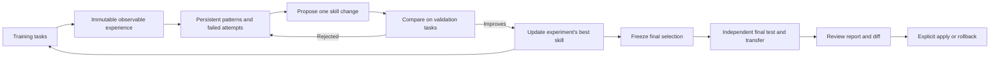

# Learning and skill evolution

The optional evolution loop learns from observable task outcomes, consolidates patterns in your wiki, proposes changes to one complete skill, and selects improvements using validation. It freezes the selected skill before running an independent final test. Your installed skill changes only when you apply the resulting proposal.

## Research basis and adaptation

The evolution design is adapted from [WikiSkill: Compiling Agent Experience into Persistent Knowledge for Skill Evolution](https://arxiv.org/html/2608.27454v1) by Liyan Tang and colleagues (Google Research and Virginia Tech, 2026). The [methodology](https://arxiv.org/html/2608.27454v1#S3) motivates the following connections:

| Paper idea | Implementation in LLM Wiki |
| --- | --- |
| Separate experience, accumulated knowledge and skills | Immutable training captures, existing source/concept pages, and a separate skill directory |
| Repeated execution, consolidation and proposal | Bounded inference, maintainer and proposer calls in `wiki_evolve_loop.py` |
| Preserve lessons when a proposal fails | Persistent patterns and acceptance history; rejected and duplicate proposals remain inspectable |
| Create or refine skills with provenance | Whole/new-skill proposals across text files, with `PURPOSE.md` evidence mappings |
| Validation gating and independent testing | Strict validation improvement selects a candidate; selection freezes before final tests and optional agent/model transfer |
| Supply skills directly during evaluation | Complete skill injection with hashes, keeping triggering failures outside the measured comparison |

Our adaptation keeps the factual task wiki available to inference while withholding the optimizer's learning history. It operates on one skill per run, uses structured proposals from supplied evidence rather than the paper's tool-driven proposer, and retains public tool observations rather than hidden reasoning. Native progressive skill discovery is not measured. Nine host adapters, ingestion/graph/hybrid-search assertions, explicit installed-skill approval, portable evidence bundles and pre-request API spending reservations are project implementation choices.

This is an adaptation, not a reproduction of the paper's benchmark study. Our [published workflow study](https://github.com/praneybehl/llm-wiki-plugin/blob/codex/wiki-skill-evolution/eval/evolution/workflows/README.md) rejected both proposed changes and demonstrated no quality gain: Codex scored 3/8 versus 2/8 and Claude 3/8 versus 3/8 with an unchanged skill. The report preserves the original evaluator limitations and subsequent corrections. Five hosts still require account/client/gateway setup, and the API budget runner lacks a live-key trial.



## Run the complete cycle

Use `/wiki:evolve` or ask your agent to run skill evolution. Resolve the factual corpus, learning wiki, raw root, and target skill separately. Use a working skill copy; an absent target directory starts with no skill and lets the proposer create one. Read the wiki's schema before writing knowledge pages.

Copy `eval/evolution/pilot/config.example.json` from the plugin repository and replace the adapter path and exact model IDs. Each role has its own runner and model: inference executes tasks, maintainer consolidates experience, proposer changes the skill, and judge verifies answers. Configure an authorized run budget before launching inference.

```bash
python <skill-root>/scripts/wiki_evolve_loop.py \
  --wiki /path/to/learning-wiki --raw /path/to/raw \
  --id query-cycle-01 --skill /path/to/working-skill \
  --suite /path/to/suite-v2.json --config /path/to/config.json
```

The loop runs a bounded number of iterations. Every iteration captures training tool events, answers, artifacts and verification; updates reusable patterns; reads previous attempts; proposes a coherent multi-file change; and compares it with the current best on repeated validation tasks. Strictly better validation performance is required. Optional cost/tool ratios and critical-task regression checks can further restrict selection. Rejected changes and their rationale remain available to subsequent proposals, while duplicate rejected candidates against the same baseline are skipped.

After all iterations, selection is frozen. The baseline and selected skill run on final-test tasks. Those results are reported, never sent back to the maintainer or proposer, and do not select another candidate. Optional `transfer` entries run that same frozen comparison through other agent/model combinations using the same judge and budget. A poor final result is a reason to withhold adoption; it is not permission to optimize against those exposed tests. Use fresh test tasks for a later study. The learning wiki records consumed test fingerprints and rejects reuse in subsequent optimization runs.

A successful run with a selected improvement creates `<run-id>-selected`, compatible with the existing review/apply commands:

```bash
python <skill-root>/scripts/wiki_evolve.py --wiki /path/to/learning-wiki show query-cycle-01-selected
python <skill-root>/scripts/wiki_evolve.py --wiki /path/to/learning-wiki apply query-cycle-01-selected
python <skill-root>/scripts/wiki_evolve.py --wiki /path/to/learning-wiki rollback query-cycle-01-selected
```

`wiki_evolve.py history` and `show <run-id>` also expose complete loop runs and their retained decisions. A completed run can select no change. A runtime failure or exhausted budget never creates an apply-ready proposal. Interrupted runs preserve evidence but cannot resume under the same ID after exposing evaluation inputs.

## Tasks and verification

Version 2 suites require separate `train`, `validation` and `test` tasks and positive/negative judge calibration cases. Every task has a question, semantic rubric, expected abstention and source paths. Calibration runs before training and must pass. Include correct paraphrases, wrong numerical answers, contradictions and plausible unsupported additions when calibrating your own judge.

The inference runner receives only the task, factual wiki, write permissions and complete skill content. It receives no rubric, split, expected answer, variant label or learning history. The adapter injects the complete skill and returns its hash; this verifies provisioning, not that the model obeyed every instruction. The prompt supplies execution boundaries and output format, without teaching the target procedure.

The independent judge sees the question, rubric, answer and source text, without the skill or variant identity. It checks meaning and source support and returns a verdict with exact source quotations. The harness verifies those quotations exist, validates citations and abstention, and checks requested artifacts. A judge that emits tool calls invalidates the run, so grades obtained with extra tool access are not accepted as blinded evidence. The judge also receives measured command output and hash-based integrity observations. In ingestion tasks, include the raw input in `sources` so faithful summarization can be checked against the capture itself. This reduces keyword-matching errors; a calibrated model judge can still make mistakes. Review material failures and report sample size, models and repeated results alongside any claimed benefit.

Task output paths are relative to the supplied wiki root. Tasks may declare `allow_write` patterns and `artifacts` checks: exact `text`/`json`, required text fragments (`contains`), recursive object/list membership (`json_subset`/`jsonl_subset`), or `absent`. Use `required_commands` to require fragments in actual shell-tool inputs, rather than accepting a claimed execution or a command quoted in source prose. This supports ingestion, editing and generated outputs in fresh workspace copies. A completed task with undeclared changes scores zero and retains violation hashes and artifacts. It skips semantic grading, discards the disposable copy and continues the comparison; runner/authentication/protocol failures still abort the run. Original source files remain protected unless explicitly permitted by the task. Regenerable `.wiki-cache/` writes are permitted in the isolated copy. Bash-capable adapters can exercise existing search scripts, including hybrid search when the copied skill and runtime dependencies are present.

For workflow trials, set top-level `runtime_python` to an absolute interpreter with the pinned dependencies already installed, and run `setup_wiki.py` before inference to prepare the local model. Both variants receive the same interpreter. The runner disables ONNX telemetry and bytecode side effects. Agents are told to use the prepared runtime without installing packages or copying host caches.

The repository fixture `eval/evolution/pilot/suite-v2.json` contains 23 fictional Lark tasks, including artifact creation. It is a public demonstration, not representative project knowledge or evidence of generalization. Replace it with a representative private corpus and independent tasks before making product decisions. Existing retrieval benchmarks remain separate.

The additional `eval/evolution/workflows/` suite freezes 16 tasks against public repository contracts, including ingestion, source/concept provenance, index/log updates, graph compilation and actual hybrid-search output. Its source manifest identifies the public commit and hashes. The corresponding study protocol and results distinguish failed executions, infrastructure blockers and measured outcomes.

Final reports include paired accuracy differences, task-cluster bootstrap intervals and paired randomization tests. Repeats are clustered by task, not counted as independent samples. The confidence threshold is adjusted across the primary and transfer comparisons. `benefit_demonstrated` requires an actual skill change and positive final evidence; passing implementation tests, a tied baseline or additional repeats cannot set it. These measurements describe the sampled tasks, not a universal performance guarantee.

## Agent adapters and budgets

The shared adapter accepts `claude`, `codex`, `cursor`, `gemini`, `opencode`, `pi`, `omp`, `hermes`, and `openclaw`. Each handles the four role contracts. Install and authenticate the corresponding host first; protocol tests do not substitute for a live account check.

```json
{"argv":["python3","/absolute/skill/scripts/wiki_evolve_agent.py","codex"],"model":"EXACT_MODEL_ID"}
```

| Adapter | Execution and model selection | Accounting |
| --- | --- | --- |
| Claude Code | `claude` stream JSON and native structured output | Reported tokens and USD |
| Codex | `codex exec` JSON events and output schema | Tokens; USD unavailable |
| Cursor | `cursor-agent` stream JSON; do not substitute an unrelated `agent` executable | Tokens/USD may be unavailable |
| Gemini CLI | Headless stream JSON, explicit model, disabled discovered skills | Reported tokens; USD unavailable |
| OpenCode | `opencode run --pure --format json`, explicit `provider/model` | Reported tokens and model cost |
| Pi / OMP | Ephemeral JSON mode, restricted tool list, no discovered skills/extensions | Reported usage and model cost |
| Hermes | Fresh ACP session with an authenticated host profile; explicit `provider:model` must resolve before inference | Completion token usage when exposed; USD unavailable |
| OpenClaw | ACP bridge to a configured local gateway; fresh session and verified canonical `provider/model` via session RPC | Approximate context pressure is not treated as billed tokens; unavailable values remain null |

A Hermes runner may set `"options":{"home":"/absolute/hermes-eval-profile"}` to use an existing profile with controlled settings; credentials are never copied or relocated by the adapter. An OpenClaw runner may set `"options":{"profile":"wiki-eval"}` to select an existing isolated gateway profile. The gateway must access the supplied local workspace, expose tool I/O, and permit the required operations under its own policy. ACP permission requests approve only scoped reads; mutation/exec requires a preconfigured bounded host policy. Hermes reloads the fresh empty session to verify the resolved provider/model after selection. Model-setting failure or silent provider fallback stops before the task prompt. Hosts retain their own system policies; their absence cannot be inferred from a successful adapter response.

The judge receives checked artifacts and every changed text artifact, including generated graph files. Exact evidence quotations may reference those saved artifacts to prove observed state; newly authored factual claims still require support from factual sources. Binary artifacts retain hashes but are not decoded for the judge.

Every observable tool event is appended and fsynced to `trace-NNNNN.jsonl` as it arrives. Timeout/crash records reference the surviving trace hash and retain bounded error diagnostics. Private reasoning and prompt echoes are excluded. Missing usage is `null`, never fabricated as zero; selection with an unavailable cost metric fails closed. The legacy `wiki_evolve_claude.py` entry point remains available.

One ledger counts every role, calibration, validation, final test and transfer runner. `max_calls` stops additional runner launches, `max_seconds` bounds total runtime, and `timeout` kills each process group at its deadline, including detached descendants discovered before the parent exits. The host must permit process inspection for descendant cleanup. These are runner/process limits, not a count of a CLI's hidden internal model requests. CLI trials require `max_usd: null`: a CLI's after-the-request cost report or native threshold cannot establish a hard dollar ceiling.

For a pre-request dollar ceiling, configure **every role and transfer runner** to use the bundled API runner:

```json
{"argv":["python3","/absolute/skill/scripts/wiki_evolve_api.py"],"model":"claude-sonnet-5"}
```

Set `budget.max_usd` and provide `ANTHROPIC_API_KEY` in the environment. Before each Messages request, the runner reserves the entire documented input-context limit plus its maximum output at reviewed first-party prices. A request that cannot be reserved is never sent. A completed response settles actual usage; a missing response retains the reservation and aborts the trial without retry. Decimal accounting prevents cumulative float admission errors. The conservative reservation requires at least $2.08192 remaining for Sonnet 5, even when the likely request cost is much smaller.

The ceiling covers this runner's standard first-party inference at the pinned rates, excluding tax and unrelated account activity. It disables caching, server tools, premium routing and arbitrary shell execution; its inference tools read/list/write permitted wiki files. Use CLI runners for shell-based workflow evaluation. The reviewed price table expires on 2026-10-13 and rejects execution until reviewed again; unsupported models fail before inference. [Claude pricing](https://platform.claude.com/docs/en/about-claude/pricing) documents the pricing and context assumptions. No API key or paid live API trial is bundled with the plugin.

The adapters reduce ambient instructions and use native restricted/sandbox modes. Host-managed policy can still apply. Workspace copies, hashes and write checks cover the copied workspace, not the entire host filesystem. Native policies may permit shared temporary directories. Runners are trusted local code, not a security sandbox for an arbitrary executable; use a separately isolated host when global write isolation is required. External model calls transmit the supplied context to the selected provider. Keep private sources, captures and credentials out of published fixtures.

## Evidence, storage and recovery

Raw training observations are saved immutably under `raw/experiences/`. Source and concept pages, index links and log entries connect observed outcomes to persistent patterns. `.evolution/learning.json` retains consolidation and proposal history across runs. The proposer receives that training history, not final-test reports. Invalid model-authored patches, including deletion of SKILL.md, are archived as rejected proposals; remaining iterations and final testing use the last valid skill. Unchanged files must be omitted from a patch; null explicitly means deletion. `PURPOSE.md` travels with the selected skill and records the reasoning, pattern boundaries and originating run/task evidence.

The harness refuses further calls if its bundled evolution runtime changes during a run, and invalidates a call if a concurrent edit occurs while it executes. Each run archive contains frozen configuration/corpus and evolution runtime scripts with hashes, observable call records, rollout artifacts, candidate snapshots, iteration decisions, selection and final results. Back up `.evolution/`; it is durable evidence, unlike `.wiki-cache/`. Ordinary search, lint, stats, graph tools and the Paperclip reader exclude this archive. Searchable lessons stay in normal wiki pages.

Apply and rollback support additions, edits and deletions across one skill. They check the entire installed skill and refuse concurrent edits. A transition journal permits recovery from an interrupted multi-file write; the operation is recoverable, not atomic to unrelated readers. Stop concurrent use of the target skill during transition. Rerun the same apply or rollback after interruption. Inspect stale wiki and skill locks before removing an empty lock left by a dead process. Never edit evidence or snapshots to force a passing result.

A completed run can be exported as one portable bundle:

```bash
python <skill-root>/scripts/wiki_evolve.py --wiki /path/to/wiki export query-cycle-01 --destination /path/to/new-bundle
python <skill-root>/scripts/wiki_evolve.py verify-bundle /path/to/new-bundle
```

The bundle contains `skill/`, `evidence/` and a SHA-256 manifest covering every file. `PURPOSE.md`, pattern mappings, observable execution records, rejected attempts and frozen source context travel together. Only `bundle/skill` belongs in a later inference workspace; the audit archive includes exposed tests and must not be injected as skill instructions. Verification checks the manifest, not a digital signature or proof that an original observation was correct.

## Manual experience and proposals

`/wiki:learn` captures completed work without launching an optimizer. Use the installed `.experience-template.json` and `.pattern-template.md`, preserve verifiable successes and failures, ingest source evidence, and consolidate existing patterns before creating new ones.

For a manual whole-skill proposal, pass a candidate directory. For a single existing file, retain `--target`:

```bash
python <skill-root>/scripts/wiki_evolve.py --wiki /path/to/wiki propose \
  --id query-manual-01 --skill /path/to/working-skill \
  --candidate /path/to/candidate-skill --evidence concepts/query-pattern.md \
  --reason "Address the verified failure"
```

The legacy `wiki_evolve.py evaluate` command and version 1 `suite.json` remain available as deterministic regression checks. Both its validation and historically named “holdout” sets participate in its gate; neither is an independent final test. Use the version 2 loop for optimization and generalization measurement.

Version 3.2.0 is additive under this project's SemVer policy; existing wikis can continue unchanged or use `/wiki:upgrade` to add optional templates. Applying a skill proposal does not publish a plugin release.
